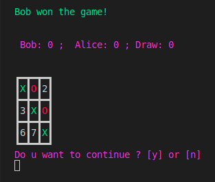

<a name="readme-top"></a>
[](https://github.com/julienbrs)
[![LinkedIn][linkedin-shield]][linkedin-url]

<!-- PROJECT LOGO -->
<br />
<div align="center">
  <a href="https://github.com/julienbrs/morpion">
    
  </a>

<h3 align="center">Tic-Tac-Toe</h3>

  </p>
</div>

<!-- TABLE OF CONTENTS -->

<summary>Table of Contents</summary>
<ol>
<li>
    <a href="#about-the-project">About The Project</a>
</li>
<li>
    <a href="#getting-started">Getting Started</a>
    <ul>
    <li><a href="#prerequisites">Prerequisites</a></li>
    <li><a href="#installation">Installation</a></li>
    <li><a href="#usage">Usage</a></li>
    </ul>
</li>
<li><a href="#contact">Contact</a></li>
</ol>

<br />

<!-- ABOUT THE PROJECT -->

## About The Project

[](https://www.python.org/)
<br />

<p align="center">
  
</p>

Tic-Tac-Toe is a classic two-player game played on a 3x3 grid. Players take turns placing their symbol (either an X or an O) on the grid, with the goal of getting three of their symbols in a row horizontally, vertically, or diagonally. If all of the spaces on the grid are filled and no player has won, the game is a draw.

This version of Tic-Tac-Toe is played in a shell and features a simple, easy-to-use interface. Players can enter their names and take turns choosing a box on the grid to place their symbol.

<p align="right">(<a href="#readme-top">back to top</a>)</p>

<!-- GETTING STARTED -->

## Getting Started

To get a local copy up and running follow these simple example steps.

### Prerequisites

- python
  ```sh
  sudo apt install python3
  ```

### Installation

1. Clone the repo
   ```sh
   git clone https://github.com/julienbrs/morpion
   ```
2. Rights to execute
   ```sh
   chmod +x morpion.py
   ```
3. Then run the program, see more info about parameters in the [Usage](#usage) section
   ```sh
   ./morpion.py
   ```

<p align="right">(<a href="#readme-top">back to top</a>)</p>

## Usage

To start the game, run the morpion.py script and enter the names of the two players. On your turn, enter the number of the box you want to place your symbol in. The game continues until one player has won or the grid is full. Enter n to start a new game at any point.

Have fun!

<p align="right">(<a href="#readme-top">back to top</a>)</p>

<!-- CONTACT -->

## Contact

Bourseau Julien - _Project done in 1st year at Ensimag, 2021/2022_ - julien.bourseau@gmail.com

Project Link: [https://github.com/julienbrs/morpion](https://github.com/julienbrs/morpion)

<p align="right">(<a href="#readme-top">back to top</a>)</p>

[linkedin-shield]: https://img.shields.io/badge/-LinkedIn-black.svg?style=for-the-badge&logo=linkedin&colorB=555
[linkedin-url]: https://www.linkedin.com/in/julien-bourseau-ba2239228
